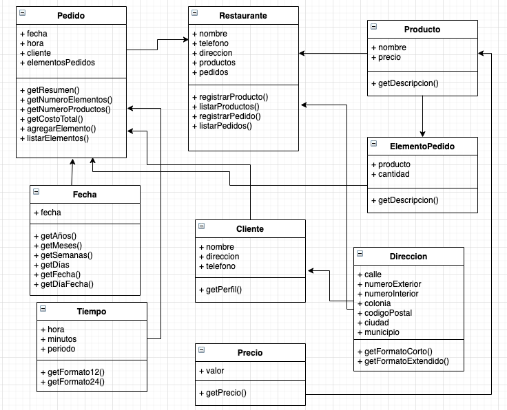

# Conceptos básicos de la POO

## El Restaurante

Se requiere desarrollar un sistema web que permita administrar los pedidos de un restaurante. Para este sistema se ha diseñado la siguiente arquitectura la cual deberás implementar utilizando JavaScript

## Descripción de clases
La mayoría de los detalles de las clases para su implementación se pueden obtener del diagrama UML. Sin embargo a continuación se presentan algunas precisiones para algunos métodos o atributos de las clases.

### La clase Fecha

- Métodos
  - getAños(). Regresa el número de años desde la fecha indicada hasta el día de hoy. El resultado debe ser un valor entero, sin decimales.
  - getMeses(). Regresa el número de meses que hay desde la fecha indicada hasta el día de hoy. El resultado debe ser un valor entero, sin decimales.
  - getSemanas() Regresa el número de semanas que hay desde la fecha indicada hasta el día de hoy. El resultado debe ser un valor entero, sin decimales.
  - getDias() Regresa el número de días que hay desde la fecha indicada hasta el día de hoy. El resultado debe ser un valor entero, sin decimales.
  - getFecha() Regresa la fecha indicada en el siguiente formato 1/Feb/2020
  - getDiaFecha() Regresa el día de la semana en el que cae la fecha indicada, por ejemplo, Lunes, Martes, etc.

## La clase Tiempo

- Atributos
  - periodo. Se refiere a el periodo del día AM ó PM
- Métodos
  - getFormato12(). Regresa la hora especificada en el formato de 12 horas, por ejemplo 1:24 pm ó 4:55 am
  - getFormato24(). Regresa la hora especificada en el formato de 24 horas, por ejemplo 13:24 ó 17:32

## La clase Direccion

- Atributos
  - numeroInterior. El numero interior del domicilio, este atributo es opcional, es decir no siempre se utiliza.

- Métodos
  - getFormatoCorto(). Regresa la dirección indicada pero solo con la calle y el número exterior, por evemplo Av. Revolución 123
  - getFormatoExtendido() Regresa la dirección indicada pero incluyendo todos los datos

## La clase Precio

- Métodos
  - getPrecio(). Regresa el valor formateado como se muestra en los siguientes ejemplos: $127.00, $127.45, $1,127.00, $34,127.45
  - 
## La clase Producto

- Métodos
  - getDescripcion(). Regresa los datos del producto en el siguiente formato. Pizza mexicana grande $200.00

## La clase ElementoPedido

- Métodos
  - getDescripción(). Regresa los datos del elemento pedido en el siguiente formato: 2 x Pizza mexicana grande $400.00

## La clase Pedido

- Métodos
  - getResumen(). Regresa un resumen del pedido en el siguiente formato: 5/Feb/2020 5:20 pm - 3 elementos con 5 productos -  total: $1,453.00
  - getNumeroElementos(). Regresa el número de elementos que contiene el pedido
  - getProductos(). Regresa el número de productos que contiene el pedido
  - getCostoTotal(). Regresa el costo total del pedido
  - agregarElemento(). Agrega un elemento al pedido
  - listarElementos(). Imprime un listado de todos los elementos que contiene el pedido

## La clase Restaurante

- Métodos
  - registrarProducto(). Agrega un nuevo producto
  - listarProductos(). Imprime un listado de los productos 
  - registrarPedido(). Agrega un nuevo pedido 
  - listarPedidos(). Imprime un listado de todos los pedidos (resúmen)
